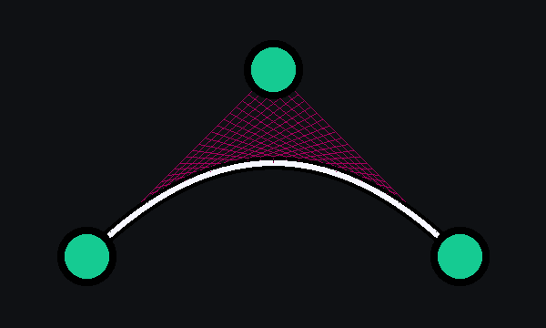
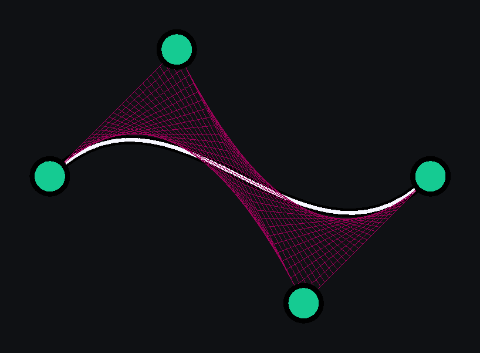

---
page->layout = "post";
page->title  = "Bézier curves";
page->date   = "2023-05-16";
page->tags   = "math simulation";
page->description = page->title;
PAGE_SET("mathjax", "true");
SET_POST();
//image: "bezier_curves_cover.png"
---

<div id="iframe-container">
<iframe class="embed" src="embed/index.html" width="100%" height="500px" frameborder="0"></iframe>
</div>


A [Bézier curve](https://en.wikipedia.org/wiki/B%C3%A9zier_curve) is defined by a set of control points \(P_0\) through \(P_n\).


### Linear Bézier curve

<figure>

<figcaption>Linear Bézier curve</figcaption>
</figure>

Given distinct points \(P_0\) and \(P_1\), a linear Bézier curve is simply a line between those two points and is equivalent to linear interpolation.

<span class="math display">\[ B_{P_0,P_1}(t) = P_0 + t ( P_1 − P_0 ) \]</span>

```python
def liear_bezier(p0, p1, t):
    return lerp(p0, p1, t)
```


### Quadratic Bézier curve

<figure>

<figcaption>Quadratic Bézier curve</figcaption>
</figure>

A quadratic Bézier curve is the path traced by the function \(B(t)\), given points \(P_0\), \(P_1\), and \(P_2\),
which can be interpreted as the linear interpolant of corresponding points on the linear Bézier curves from \(P_0\) to \(P_1\) and from \(P_1\) to \(P_2\) respectively.

<p><span class="math display">\[ B_{P_0,P_1,P_2}(t) = (1−t) B_{P_0,P_1}(t) + t B_{P_1,P_2}(t) \]</span></p>


```python
def quadratic_bezier(p0, p1, p2, t):
    v0 = liear_bezier(p0, p1, t)
    v1 = liear_bezier(p1, p2, t)
    return lerp(v0, v1, t)
```


### Cubic Bézier curve

<figure>

<figcaption>Cubic Bézier curve</figcaption>
</figure>

Four points \(P_0\), \(P_1\), \(P_2\) and \(P_3\) define a cubic Bézier curve. The curve starts at \(P_0\) going toward \(P_1\) and arrives at \(P_3\) coming from the direction of \(P_2\).
The cubic Bézier curve can be defined as an affine combination of two quadratic Bézier curves.

<p><span class="math display">\[ B_{P_0,P_1,P_2,P_3}(t) = (1−t) B_{P_0,P_1,P_2}(t) + t B_{P_1,P_2,P_3}(t) \]</span></p>

```python
def cubic_bezier(p0, p1, p2, p3, t):
    v0 = quadratic_bezier(p0, p1, p2, t)
    v1 = quadratic_bezier(p1, p2, p3, t)
    return lerp(v0,v1,t)
```


Check out the code on [GitHub](https://github.com/hanion/bezier_curve).  
Read more about Bézier curves on [Wikipedia](https://en.wikipedia.org/wiki/B%C3%A9zier_curve).
