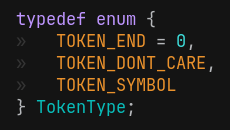
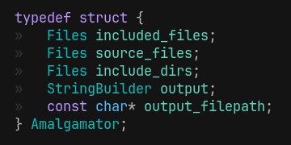

```c
page->layout = "post";
page->title  = "Building a custom C skin";
page->date   = "2025-08-24";
page->tags   = "programming language c";
page->desc   = "C* the Turkish C";
SET_POST();
```


This is [C*](https://github.com/hanion/cey), the Turkish `C` skin.

Its compiler transpiles `.cy` files into plain `C` and compiles them with `gcc` or `clang`.
It can run in reverse to turn `C` back into `C*`.
You can also modify the dictionary to create your own `C` skin.


# Motivation
I was developing an interpreted language ([minik-script](https://github.com/hanion/minik-script))
in `C++` following the book [Crafting Interpreters](https://craftinginterpreters.com/).
This was my first experience developing an interpreter, so I followed the book as closely as I can.
Including the dreaded **Visitor Pattern**.
It was going well until there were any bugs or I needed to add a feature.
Debugging or adding features was painful.
The design felt too complex, and I hated dealing with it.

I wanted to write another language using simpler design patterns.

I also have always had a fear of strings. I relied on `std::string`.
I didn't know how and where they were stored, who owned them,
when was I copying or taking by reference ...  

I realized I needed a deeper understanding of strings.
So I tried handling strings in `C`.
Is it as hard as I feared? I wanted to know.


# How it works
The compiler itself, `cey`, handles parsing, tokenization, and string management entirely in `C`.
It has a simple lexer, and a dictionary.
It does not have a Parser.


## Strings


I used a simple `StringView` idea, also called `slice` or `span`,
that is just a pointer and a length, not claiming any ownership of the original string.

The string (file content) is owned by the compiler.
Compiler reads the file to a buffer, and passes it down to Lexer, and when compiler is done, it frees the buffer.
Simple as that!


## Token
Token has a `TokenType` and a `StringView`.



These are the only token types we need for translating the language.
We have other token types like number, newline, comment to be able
to support "packing" feature (minifying by stripping whitespace and newlines).
It had no purpose other than to be a challenge to me.


## Lexer


Lexer is just scanning the content, and generating tokens.
It needs to know if its in preprocessor mode, and if the preprocessor is in a string.
Which is needed for include directives.

## Dictionary


This is the part where we hold the *"skin"*.
When a symbol token is found, the compiler looks it up in the dictionary and translates it.


## Compiler


<?/* code in the figure:
if (token.type == TOKEN_SYMBOL) {
    const char* to = find_keyword(&token, lexer.preprocessor_mode, is_reverse);
    if (to) da_append_cstr (&output, to);
    else    da_append_token(&output, token);
}
*/?>

If the token is not a symbol, it is printed as is.
If the token **is** a symbol, meaning its not in a string literal or in a comment,
it will look for the symbol in the dictionary.
If the token is found, it's translated.
If the token is not found, it's kept as is.

# Experiments

## Reverse mode
We can run the compiler in reverse and generate `C*` code from `C`
by simply flipping the dictionary.
This is what `yec` does.

## Amalgamator


I also wrote an amalgamate generator as another challenge.
This program uses the lexer from `cey`.
It reads `C` files and concatenates them, expanding include directives, keeping track of included files.

I still use this for another project of mine: [cook](https://github.com/hanion/cook).


## Bootstrapping
With `yec` and `amalgamator`, the compiler can bootstrap itself.
This can be done with `make bootstrap`, and it will:

- Use `amalgamator` to generate `build/amalgamation.c` from `src/cey.c`.
- Reverse-transpile it into `examples/cey.cy` with `yec`.
- Rebuild `cey` from the `C*` source.


# Make your own skin
Just change the dictionary in the `src/dictionary.c` and you have your own skin.
You can use `yec` to transpile some `C` sources to demo your own skin.


# Conclusion
The project started as a way to face my fear of strings, but ended up making me comfortable in `C` as a whole.
Now I prefer direct, predictable `C` code.

Along the way, I tried a couple ideas:
- I experimented with [Unity Build](https://en.wikipedia.org/wiki/Unity_build).
- I tried passing an options `struct` instead of a long argument list.
- I tried the dynamic arrays in `C` idea from [Tsoding's tweet](https://x.com/tsoding/status/1897404532331831692).

# Source
Source is available on GitHub: [https://github.com/hanion/cey](https://github.com/hanion/cey)

