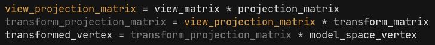

---
page->layout = "post";
page->title  = "Writing a game engine for embedded";
page->date   = "2025-07-21";
page->tags   = "embedded game engine rasterizer";
page->description = page->title;
SET_POST();
---

[embedded-engine](https://github.com/hanion/embedded-engine) is a game engine running on an embedded microcontroller.
No operating system, no GPU, just C/C++ and a frame buffer.
It renders 3D models, runs a raycasting engine, and simulates things like falling sand and Tetris.

# Understanding LED Panels
I did not know how LED panels worked before jumping into this project.
The first step was understanding how they work.

Controlling each pixel individually would require too many pins.
To solve this, LED panels use [shift registers](https://en.wikipedia.org/wiki/Shift_register),
which let you send data serially and display it in parallel.
You shift the data in, latch it, and the registers holds the full frame.

Then comes the scanning.
LED panels have certain scanning patterns, I needed to figure out how this one scans the panel.
So I started pushing one pixel at a time, and just watched and counted how they appeared and in what order they appeared.

With that knowledge, I wrote a display driver to push a **frame buffer** onto the panel.

Then I spent a lot of time tweaking timings to reduce flickering and get a stable, uniform image.
Most difficult part of this project was _**timing**_.

# Rendering text
After getting the display driver working, the next goal was to render and scroll text.
So I implemented basic [bitmap font](https://en.wikipedia.org/wiki/Computer_font#BITMAP) rendering.

When I tried scrolling the text, there was noticable tearing.

I fixed it by adding double buffering and tweaking the timings **a lot**.

# Frame buffer ??
Wait... a frame buffer? That means I can draw anything to it!
I figured the best thing to try on a 64×32 display was a cellular automaton.
First I programmed [The Rule 110](https://en.wikipedia.org/wiki/Rule_110).
Then I programmed [The Game Of Life](https://en.wikipedia.org/wiki/Conway%27s_Game_of_Life).

# Can I make a game ?
I wanted to write a game for it, but how could I interact with it?
The proprietary board running this panel had one button, for resetting.
So I thought I could repurpose this button.
I thought about what games could I make with one button,
and [Dinosaur Game](https://en.wikipedia.org/wiki/Dinosaur_Game) came to my mind.

# Connecting a keyboard
Dino game was fun but I wanted more.
There wasn't much to do with one button, so went looking something else.
I decided to connect my keyboard through [UART](https://en.wikipedia.org/wiki/UART),
this way I could interact with it properly.
Which meant that I could make a proper game now.

# Simulation
Since I am just drawing to a frame buffer,
The platform underneath does not change the result of the drawing.

So I decided to create a simulator, that just renders the frame buffer with raylib.
This decreases the iteration time.
I dont need to upload the code to the board everytime.

# Proper game engine
If I want to make a proper game, I need a proper engine.

## Event manager
Having two platforms creates two different paths for receiving events.

The simulations polls events at the start of each frame.
This is achieved with Raylib functions like `IsKeyPressed`, `IsKeyDown`, `IsKeyReleased`.

The embedded system however recieves events from UART with interrupts, and only for pressing or releasing buttons.
We need an encompassing method for handling both versions.

In the embedded system, we only receive interrupts when the key is pressed or released.
We need to generate `Held` events in the `EventManager`.

When we receive a key interrupt, we _"activate"_ the key.
This creates a `Pressed` event and adds the keycode into a list called `active_keys`.
This list is iterated every frame, and `Held` events are generated for each item.
When we _"deactivate"_ a key, one `Released` event is generated and the keycode is removed from the list.

## Application API
This is the entirity of the `Application` API:

# 3D Rendering
Why not write a software rasterizer?
I have never written a sofware rasterizer before, but i knew how things work, thanks to [Pikuma](https://pikuma.com)!
There is an amazing [YouTube Playlist by Pikuma](https://www.youtube.com/playlist?list=PLYnrabpSIM-97qGEeOWnxZBqvR_zwjWoo) explaining 3D Graphics.
I started with implementing the basics, like Vector, Matrix, and Transform structures.

Now when I look back at it, I couldve used vectors in the `Transform`,
but I created the `Vec3` later, so I probably did not see that.

Then I implemented the matrix calculations.

I created `Vertex` and `Face` for my `Mesh`.

Then doing all the calculations and drawing the mesh to the buffer.

Theres the cube rendered with perspective projection. Finally!

Then I wanted to render something more complicated than a hand crafted cube.
I couldnt easily port `obj` files into my engine in C,
so I wrote a python script to convert `obj` files into my mesh format.
This python script takes the `obj` file and spits out a C source file containing the mesh data.

I went into blender and created a torus model, exported it to an `obj` file.

I tried to add face filling, drawing filled polygons instead of just outlines.
But the device just couldn't handle it. It was too slow.
Just filling the faces slowed the device so much, that I did not even try implementing a depth buffer.

Without a depth buffer, the best I could do was backface culling.

# Plan B: Raycaster
Adding raycaster was easier.

No projection matrix, no vertex transforms, just ray math.

I added sprite and texture rendering next.
Then I created a simple enemy that follows the player and deals damage when it gets close.
After that, I added a projectile system and implemented shooting.

But when I started firing a lot, the engine began crashing.
Firing the 32nd bullet would freeze the entire system.
Turns out, I was triggering an `std::vector` resize, which hit the heap limit.

The fix was increasing the heap size and giving projectiles a lifetime, so they could be recycled properly.

# Falling sand
I always wanted to try falling sand simulation.
I implemented it by learing it from [Coding Train's Video](https://www.youtube.com/watch?v=L4u7Zy_b868).

# Tetris
I love tetris, I have almost always implemented tetris whenever I saw the opportunity.

# Final Thoughts
I really enjoyed working on this project.
I loved learning more about 3D projection, rasterization, and raycasting.
The falling sand simulation was also fun to implement and play with.

The hardest part was getting the _**timing**_ right for the embedded system.
Making my code run correctly on an embedded device feels kind of magical.

# Source Code
The source code for this project is available on GitHub: 
[https://github.com/hanion/embedded-engine](https://github.com/hanion/embedded-engine)

