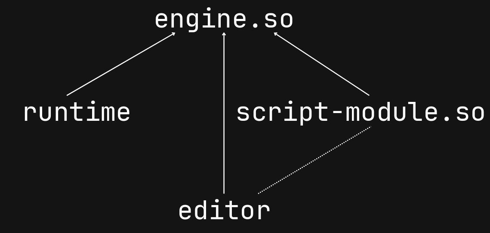
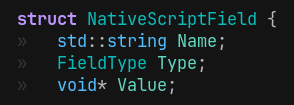
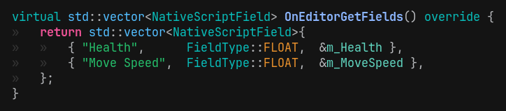
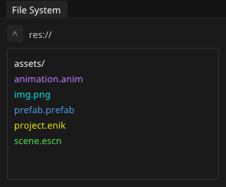
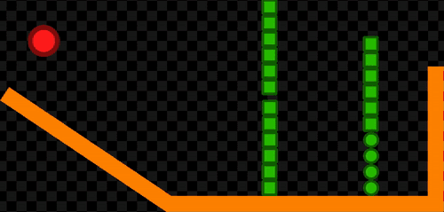
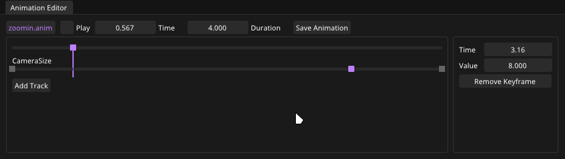
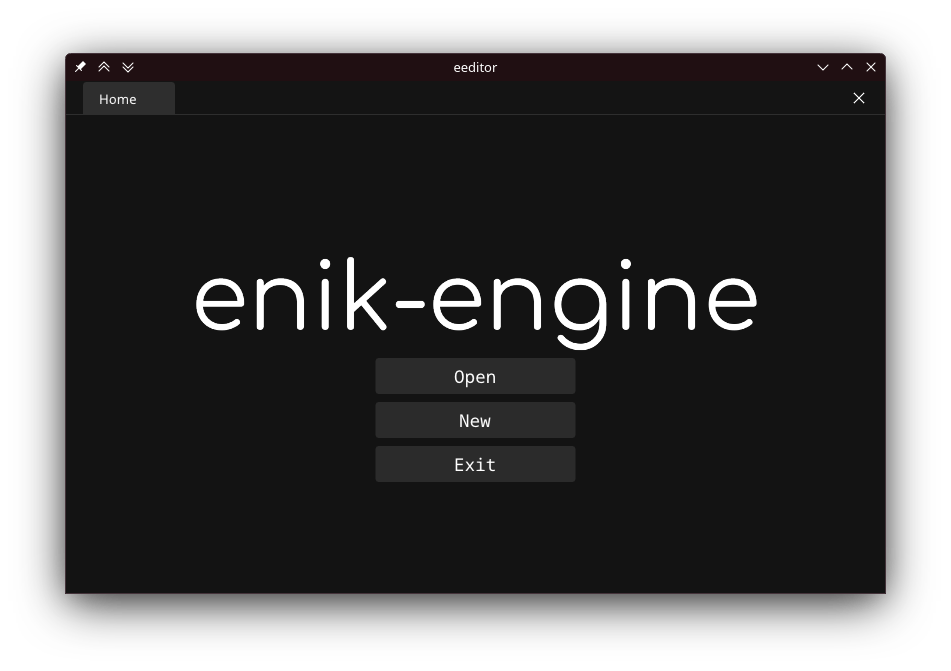

```c
page->layout      = "post";
page->title       = "Building a game engine in C++";
page->date        = "2025-09-05";
page->tags        = "custom game engine editor scripting system physics";
page->description = "About my custom game engine enik-engine and its systems";
SET_POST();
```


[enik-engine](https://github.com/hanion/enik-engine)
is a `C++` game engine I've been building from scratch over the past few years.

What began as a weekend experiment slowly turned into a full engine with an editor, scripting, physics, animation, and more.

The whole point was to explore low-level systems programming, not to compete with Unity, Unreal, or Godot.
I wanted something small, fast, and fun to build.

The real joy of this project was *speed*: hot reloading made iteration almost instant, so I could try things out as soon as I wrote them.


# Under the hood
enik-engine is written in `C++`.
- [GLFW](https://github.com/glfw/glfw) for windowing
- [GLM](https://github.com/g-truc/glm) for [math](https://en.wikipedia.org/wiki/Mathematics)
- [Dear ImGui](https://github.com/ocornut/imgui) for the editor interface
- [EnTT](https://github.com/skypjack/entt) for the [ECS](https://en.wikipedia.org/wiki/Entity_component_system)
- [Jolt](https://github.com/jrouwe/JoltPhysics) for physics
- [Tracy](https://github.com/wolfpld/tracy) for profiling
- [yaml](https://github.com/jbeder/yaml-cpp) for saving/loading data


# Architecture
enik-engine is built for a fast development cycle.

The core engine is a dynamic library, shared by both the editor and the game.
Game code is compiled separately as a script module that the editor links at runtime.

This setup makes hot reloading possible: you can recompile the game code and reload it in the editor without restarting.




# Scripting system
## Live hot reloading
Hot reloading C or C++ code is not easy, especially if what you are reloading is complex.
Many engines require complicated systems, and Unreal for example, often needs full rebuilds just to stay stable.

enik-engine does something unusual.
The game is running, update functions are being called every frame,
and on the next frame, the new module is already loaded and running, just by replacing the module.
It should not work.

**IT LIVE HOT RELOADS. ON THE FLY.**


Seeing changes applied live, while the game continued running, was unbelievable.
It was consistent, seamless, and crashed less than Unreal.
I developed all my games using this system.

The editor replaced the module and its instantiation functions, yet the game state remained intact and the new functions ran immediately.
The module was replaced exactly as before, and the functions line up. How was the data still preserved?
It boggled my mind.
Because it worked consistently, I didn't investigate further and just used it as a killer feature.

## What happened to live hot reload
I don't know. It just vanished.
It still hot reloads, but now you need to stop the game and press play again.
The editor itself doesn't require a restart, which is still convenient.
*Still hot but not live hot.*

When writing this post, I considered investigating why it worked, but it doesn't anymore.

My best guess is that a Linux update changed the dynamic linkers behavior.
If anyone has any idea about how that was happening, or why it stopped working, I'd love to hear it.

## Scripting
Scripting is done by inheriting from the `ScriptableEntity` class and registering it.
It holds an Entity ID and some callback functions like `OnCreate` and `OnUpdate`.


This class can be attached to an entity through a `NativeScript` component.


The instance is created by the engine when the Entity is created.

Fun fact: I didn't know about tagged unions, so I reinvented them:



> yes I managed the memory manually please don't look

The editor can show these fields in the inspector by calling `OnEditorGetFields`.
This can be implemented by the developer in their class derived from `ScriptableEntity`.



The instance must exist before we are able to call this function.
So we create a temporary instance when binding the script, and save the fields to the `NativeScript` component's map.
When the real instance is created, we copy the saved values from the map to the new instance.


# Editor
enik-engine has a custom editor built with [Dear ImGui](https://github.com/ocornut/imgui).
I worked on it more than necessary.
I love [bike shedding](https://en.wikipedia.org/wiki/Law_of_triviality) unfortunately.


## Inspector
Inspector shows the entities components and values.
It can also show any fields exported by the `ScriptableEntity`.


Of course I spent too much time working on the inspector
so it includes all the 'nice to have' features like
drag&drop and `Asset` buttons.


## Colors
Assets and components are color-coded for quick identification.

<div style="display: flex; gap: 1em; flex-wrap: nowrap; justify-content: center; align-items: flex-start;">


</div>


## Tabs
While using Unity, the interface made me feel claustrophobic.
When you need to check something in another scene,
you have to find that scene, open it, check what you need,
then go back to the first scene and open it again.
Your file browser may also be in a different place, forcing you to browse again


I used Unreal for a little bit and I loved the tabbed interface.
So I stole it.
In my engine you can open multiple scenes or prefabs or assets in tabs.


# Physics engine
I followed the [Designing a Physics Engine in 5 minutes](https://www.youtube.com/watch?v=-_IspRG548E)
video and created my own 2D physics engine,
which I used for the first few games I made with the engine.

I wanted to add 3D to the engine and I needed to support 3D physics.
So I decided using a proven physics engine would be better,
since I doubt I could make a performant physics engine in a short time.

I chose Jolt Physics, which was an experience...
Talked about it here: [My experience with Jolt Physics](/post/my-experience-with-jolt)




# Prefab system
Prefabs are almost essential in an engine that is primarily used through an editor.
Because creating an configuring entities take more time.

I implemented prefabs like scenes in terms of serialization.
A prefab is just a scene file with only one root entity.

## I wish it was that easy...
We face a few problems: What to do with IDs? How to handle references?
We cannot keep IDs in the prefab because multiple instantiations would collide.
If we randomize the ID's, then the references between the entities inside the prefab does not work.

To solve this, we randomize the ID we find, but when we encounter the same ID, we assign the same randomized ID to it.
This both randomizes the ID's and preserves relationships.

### Overrides
Even though it is a prefab, we should be able to override some of its values.
Like its `Transform` and `Family` components.
Otherwise every instance would appear in the same place with the same hierarchy.

This means we need to instantiate the prefab first,
then override some of its values with data from the scene.

### Defaults
If all values were overridden, updating the prefab globally wouldn't work.
The point of a prefab is to allow centralized updates.

How should we handle it?
Do we need to keep a pure instance of the prefab around and check each value?
Do we only save the edited values?
These would mean changing the whole system to track changes and stuff.

How did I handle it?
I only allow overrides of the `Transform` and `Parent` from `Family`.
It's limited, but it worked well enough.

### Nested prefabs
We need to be able know if the entity we created and are deserializing currently is a prefab.
If it has a Prefab component, we delete it and instantiate the prefab it points to.

To avoid recursively instantiating the original root prefab, we mark it as `RootPrefab`.

## This took time...


# Asset System
Assets in enik-engine are shared.
Each asset is referenced using an `AssetHandle`, so multiple systems or entities can use the same resource without duplicating it.
The `AssetManager` takes care of loading, storing, and tracking assets for the engine.

# Animation system
Since I was preparing the engine for a game jam, and had very little time,
I have implemented a bare bones animation system.
It is basically a value interpolator.



An `Animation` is a list of `Track`s that are played simultaneously.  
A `Track` contains a `TrackProperty` and a list of `Keyframe`s.  
Each `Keyframe` stores a time point and a value.


It doesn't get the properties each frame, it relies on a value pointer.
I think you can see what kind of problems it can create.
And it did deliver! It made me bang my head to the wall a lot in the game jam!

Property pointers meant that if an entity gets destroyed,
and the ECS reorders the component arrays,
we have a beautiful dangling pointer in our hands.

How did I solve this issue at the game jam?

I did what's called a "pro game developer move".
I just didn't destroy any entity.
I teleported the ones I wanted gone to infinity.


# Text rendering
I used [stb_truetype](https://github.com/nothings/stb/blob/master/stb_truetype.h)
to import the font, pack it to an atlas, and save the glyphs into an asset.


Text is rendered using the atlas,
so drawing strings is just fetching the right glyphs and drawing quads.


# Audio system
For audio, I kept it simple.
I used [miniaudio](https://miniaud.io/)
to play WAV files.

It doesn’t have 3D spatialization, modulation, or fancy effects.
I just needed it to exist for the same game jam where I implemented the animation system.


It works reliably and is enough to play sounds, music, or simple cues in the engine.

# Performance
Performance was good out of the box since the engine isn't as bloated as bigger engines.
After adding batch rendering, it became more than enough for my needs.
Here we are rendering 100k+ quads for testing:


# Profiling
Used [Tracy](https://github.com/wolfpld/tracy) for profiling the engine.


# Your first enik-engine project
Clone the repository with submodules using the `--recursive` flag:
```sh
git clone --recursive https://github.com/hanion/enik-engine
cd enik-engine
```

Build the engine and its dependencies:
```sh
./build.sh
# or alternatively:
mkdir build && cd build
cmake ..
cmake --build .
```

Open the editor:
```sh
./build.sh run
# or alternatively:
./build/editor/editor
```



Press **New** -> **Project** and select Empty or Example project.


Select an empty directory for the project to be created.
Build your game, or play around with example projects.

Export the project:
```sh
./export.sh platform game-title /path/to/project/
```
Ensure the directory contains a `project.enik` file before exporting.

Exported project files are located in: `enik-engine/export/platform/game-title`

You have built your first project in enik-engine!
**Congratulations!**


# Reflections
Building enik-engine taught me a lot about low-level systems programming,
memory, architecture, hot reloading, and GUI design.

I also learned how to structure a project for longevity, mostly by failing at it.

## What I would do differently if I built it again
- Focus on core features (avoid features I thought I might need)
- Cut unnecessary abstractions (renderer was abstracted but only OpenGL used)
- Reduce compile times (maybe avoid `C++`)
- Avoid `C++` templates (debugging is a nightmare)
- Consider using plain `C` instead of `C++`
- Avoid smart pointers, use arenas instead
- Reduce third-party libraries (more fun to reinvent the wheel)
- Less perfectionism, more pragmatism
- Don’t fear things I haven’t tried (like text rendering)
- Too many API interfaces (preprocessor is good enough)
- Possibly create my own ECS
- Skip Jolt (stick to my own physics engine or something simpler)
- Avoid spdlog (too many linking issues on Windows)

These are the notes I took while developing it, based on my experiences, and might not fit your situation.


# Games made with enik-engine

<iframe loading="lazy" frameborder="0" src="https://itch.io/embed/3622718?border_width=0&amp;bg_color=141414&amp;fg_color=cfc6b8&amp;link_color=e6482e&amp;border_color=141414" width="100%" height="165">
    <a href="https://hanion.itch.io/square-up">square up by hanion</a>
</iframe>

<iframe loading="lazy" frameborder="0" src="https://itch.io/embed/3197293?border_width=0&amp;bg_color=141414&amp;fg_color=eeeeee&amp;link_color=4d4640&amp;border_color=141414" width="100%" height="165">
    <a href="https://hanion.itch.io/reborn">reborn by hanion</a>
</iframe>

<iframe loading="lazy" frameborder="0" src="https://itch.io/embed/2703182?border_width=0&amp;bg_color=141414&amp;fg_color=eeeeee&amp;link_color=b4724a&amp;border_color=141414" width="100%" height="165">
    <a href="https://hanion.itch.io/gear-gambit">gear gambit by hanion</a>
</iframe>

<iframe loading="lazy" frameborder="0" src="https://itch.io/embed/2691954?border_width=0&amp;bg_color=141414&amp;fg_color=eeeeee&amp;link_color=198C19&amp;border_color=141414" width="100%" height="165">
    <a href="https://hanion.itch.io/snake-game">snake game by hanion</a>
</iframe>


# Source Code
[https://github.com/hanion/enik-engine](https://github.com/hanion/enik-engine)

<iframe loading="lazy" frameborder="0" src="https://itch.io/embed/3202738?border_width=0&amp;bg_color=141414&amp;fg_color=ffffff&amp;link_color=e57e19&amp;border_color=141414" width="100%" height="165">
    <a href="https://hanion.itch.io/enik-engine">enik-engine by hanion</a>
</iframe>


