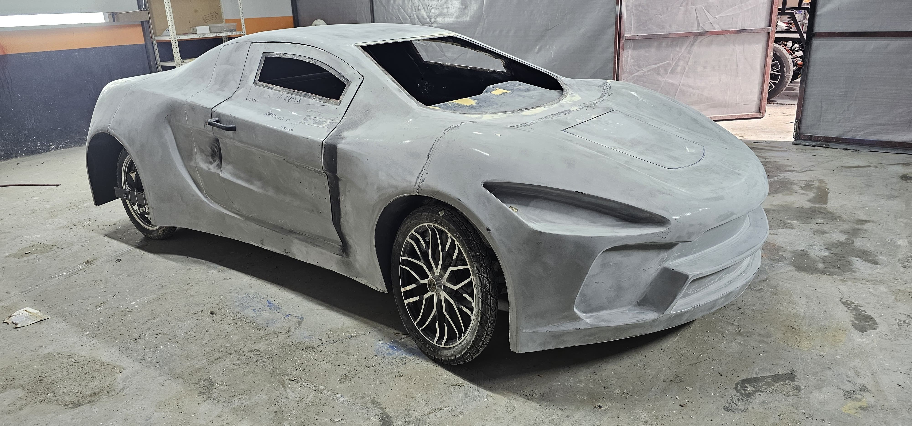
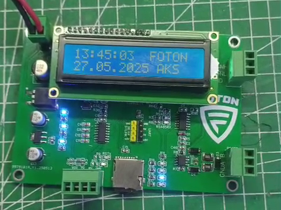
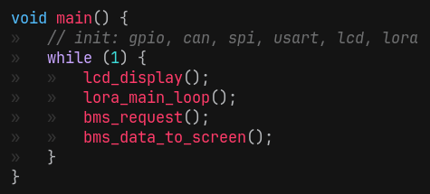
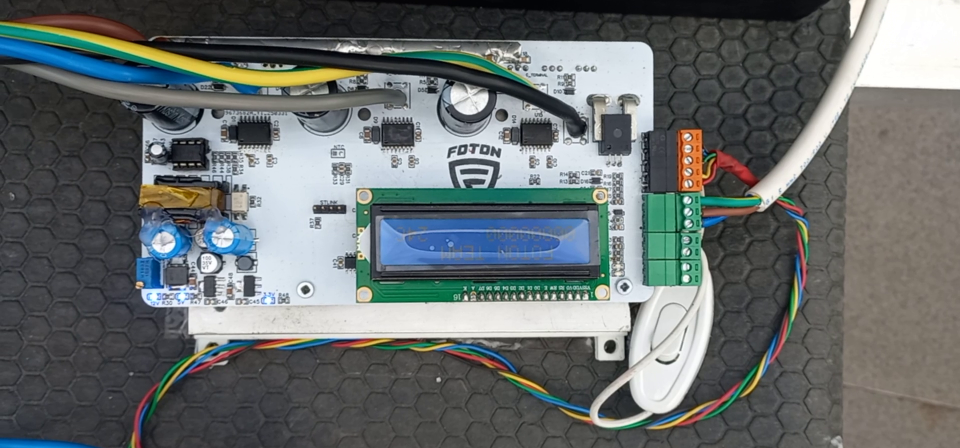
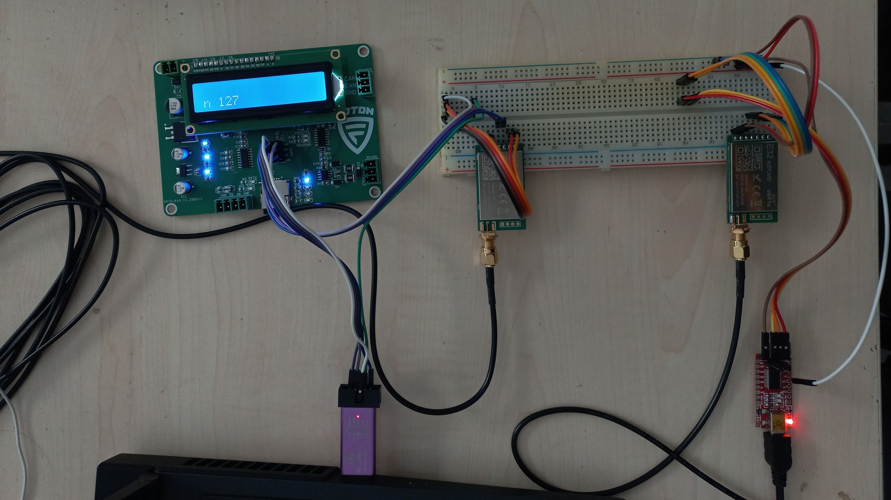
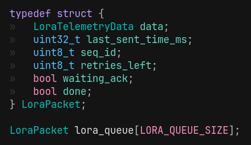
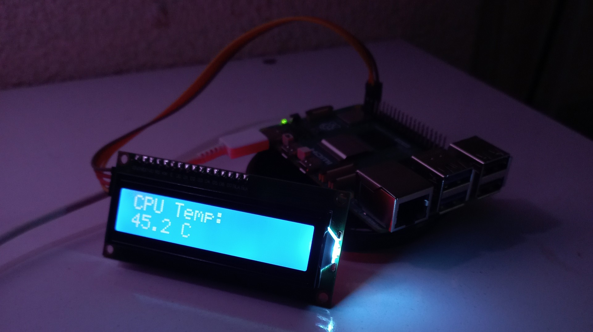

```c
page->layout = "post";
page->title  = "Engineering an electric vehicle";
page->date   = "2025-09-27";
page->tags   = "embedded stm32 lora vcu adas raspberry pi motor control";
page->desc   = "Building an EV and working on VCU, telemetry, ADAS, motor drivers, and dashboard systems.";
SET_POST();
```



I was part of a team building a high-performance electric vehicle for the Teknofest Efficiency Challenge 2025.

I worked on the VCU (Vehicle Control Unit), the telemetry system,
the ADAS (Advanced Driver Assistance Systems) components,
the dashboard display, parts of the motor driver.


# Vehicular Control Unit



I maintained and extended the VCU software running on STM32 microcontrollers.

The VCU is the heart of the car.
Throttle input comes here first, then it forwards commands to the motor drivers,
which run their PID loops and actually move the vehicle.
It also talks to the battery management system, collects status data,
reacts when needed, and pushes that information to the displays.



Most of this runs over CAN bus.
The VCU also had a screen right behind the wheel, connected over RS232,
showing speed, tachometer, battery percentage, warning lights, and other essentials.
Separate from that, there was a larger dashboard screen.

This was the core system, ensuring reliable communication between the motors, battery, and displays.


# Motor Driver



The motor drivers received commands from the VCU over CAN bus and controlled torque and speed.
They communicate with the VCU over CAN bus, both drivers are on the same line, each with its own ID,
one spinning clockwise and the other counter-clockwise so the wheels move in the same direction.

I joined the team after the initial firmware was written, I maintained and improved it.

At first the system used torque control, which caused issues under load.
When the car went up a hill the controller tried to hold torque steady,
pulling more and more current until the MOSFETs exploded.
After switching to current control the drivers became stable and we didn't see those failures again.


# Telemetry System



The competition required the car to send performance data to a watch center every second.
If the connection dropped, the system had to store the data locally until reconnection,
but it wasn't allowed to save anything while the link was up.


At first, the team tried a Teltonika FMC650 using GSM.
I spent time setting it up and integrating it with the VCU,
but it was unreliable, and the VCU had no way to know if data was actually sent.



We switched to LoRa, which is simple and requires no GSM or server.
I designed a packet system with IDs and acknowledgments to ensure nothing was lost.
Failed packets were retried a finite number of times, and if all failed, written to SD.
The system proved robust and reliable.

I also made a cross-platform listening station interface in Qt,
but in hindsight Dear ImGui would have been simpler, more portable, and faster to develop.

# Advanced Driver Assistance Systems



I developed the software running on the Raspberry Pi,
which handled ADAS features and the dashboard display.
It managed sensor data, GPS, blind spot sensors, the back-facing camera, and automatic headlights.

I also wrote a process manager in Go to monitor services,
log everything with timestamps, restart failed processes,
and keep all functions running reliably.

The LCD was a simple Python script that displayed the Pi's IP for SSH access during development and debugging.

NavMap displayed the race track using GPS data from a u-blox module and positioned the track map accordingly.

The dashboard also showed the back-facing camera feed when the car was reversing.
The front camera and line-tracking AI were part of ADAS but were developed by another teammate.

Altogether, the Raspberry Pi ran all the software powering the dashboard and ADAS features,
combining navigation, live camera feeds, and sensors into a single, robust system.


# Reflections

Working on this EV let me touch almost every layer of the system,
the VCU, ADAS, telemetry, motor drivers, and the Raspberry Pi dashboard.

I learned the importance of having control over the system.
I wrote the telemetry and dashboard software myself and it worked reliably,
which made a big difference compared to the parts I could not control.

I also realized that until you test something completely,
you can never be sure it will behave as expected on real hardware.

Simple things take longer than expected, and iteration speed is critical.
Long cycles, like with the Teltonika FMC650, make development inefficient.

In the end, the project reinforced that control, testing,
and iteration are what make complex systems actually work in practice.


