```c
page->layout = "post";
page->title  = "Site generation with C templates";
page->date   = "2025-08-09";
page->tags   = "static site generator c template markdown";
page->desc   = page->title;
SET_POST();
```

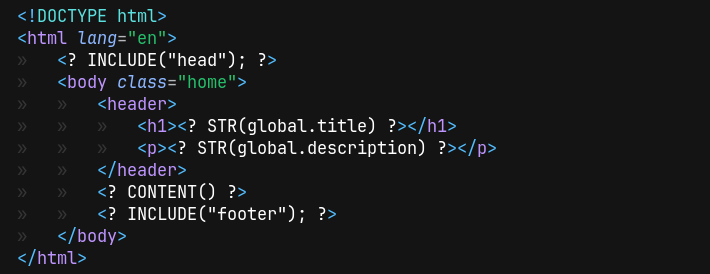

This is a [mite](https://github.com/hanion/mite) template.
It is HTML with C between `<?` and `?>`.

# What is mite?

[mite](https://github.com/hanion/mite) is a static site generator written in C.
It uses templates that are basically plain HTML files with embedded C code between `<?` and `?>`.
This lets you write your layouts as HTML while using C code for dynamic parts like
inserting lists or including other templates.
There are no dependencies or external tools.
You just need a C compiler.
The output is plain HTML files ready to be served.

Here's a simple template snippet that dynamically generates a list of links:

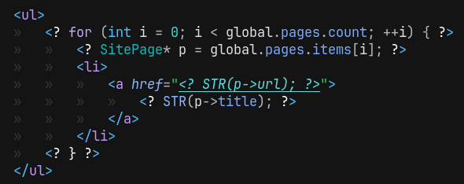

You write mostly HTML with small embedded C blocks to insert dynamic content.
No extra templating language, just plain C inside HTML.


# Inspiration

I got nerd sniped by Tsoding's video [Server-Side Rendering in C](https://www.youtube.com/watch?v=dkNv3KGOFT0).
The idea of templating with plain C hooked me.


I had recently moved from Jekyll to plain HTML ([explained here](/post/i-rebuilt-this-website))
and was using [pandoc](https://pandoc.org) to convert Markdown to HTML.
And I didn't want to use it anymore.

I figured I could write my own Markdown renderer. Markdown looked simple enough. It wasn't.
I built [a markdown renderer of my own](https://github.com/hanion/md2html),
which ended up taking more time than expected even for my limited needs.

After that, I started working on the templating engine.

# Templating engine
The engine runs in two modes: HTML and C.  
It starts in HTML mode. When it sees `<?`, it switches to C until `?>`.

## Example

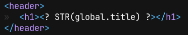
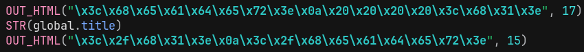

The macros handle output, they append to the current output `StringBuilder`.  
HTML bytes are stored directly, so that we dont have to mess with escaping.  
When this generated code runs, it outputs this:

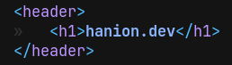

# Second Stage
The generated code is pasted into a new file `site.c` as the second stage in the process.
It is compiled and run by the first stage.

Second stage has these responsibilities:
- Construct a global state
- Construct the templates list with their details
- Render each page with its layout

## Construct a global state
Second stage creates fills a global struct for all the pages and templates to use.
This is done by pasting the front matter of all the pages.

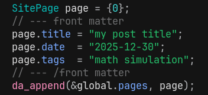

## Construct the templates list with their details
We need to assign a function to the name of the template, heres where we fill this.

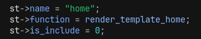

## Render each page with its layout
First I was searching for "`CONTENT()`" in the templates
and replacing it with the rendered HTML directly as a string.

This meant every page had its layout printed directly into it at build time.
It worked, but it wasn't flexible.
The layout had to be known in the first stage,
meaning layouts couldn't be changed dynamically in the page's front matter.

This made me rethink the architecture of the templating engine.
Why was I manually searching and replacing `CONTENT()` ?

A template should be able to render multiple pages, so I cant just make the macro the lines that render the content.

Instead of printing templates everywhere, each template became a function.
The function takes the page's content rendering function as an argument, so any layout can render any content at runtime.

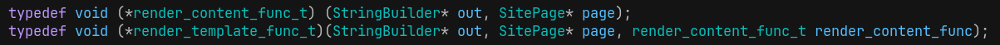

At render time we find the correct template function and call it with the page and its content function.

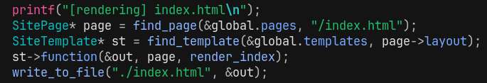

And because the rendering happens at runtime (after parsing the front matter),
the same templating system can be used not only in layouts,
but also **inside the markdown content itself**.

# `INCLUDE` macro
I used the same approach with includes.
Instead of concatenating the included file as static HTML, we just call its template function.
That means includes can be templated too.

An `include` template and a `layout` template are actually the same thing under the hood.
We construct it the same, and we call it the same.

An include can even have nested `INCLUDE()` calls or a `CONTENT()`.
(it really shouldn't, but why not?)
It can even include itself, until we blow the stack.

# RSS
You can generate `rss.xml` by creating `rss.md` and setting this files
output like `page->output = "rss.xml";` in its front matter.
Take a look at this site's <a href="https://github.com/hanion/hanion.github.io/blob/main/rss.md">rss.md file</a>.

# Incremental rendering
I have implemented incremental rendering, just like build systems.
As in only rendering files that have changes.
It does not work as well as I have anticipated.
Since some pages require every page to be known, like archive,
we have to render every page.

I decided to just keep the watcher.
It runs on the background while serving with `--serve`,
polling the changes, and if there are any changes,
it just rerenders everything.
Which saves one key press.

# Real world usage
This site is built with mite. You can explore its source code to better understand how it works:
[https://github.com/hanion/hanion.github.io](https://github.com/hanion/hanion.github.io)

I also made my friends sites using mite, and they turned out really good.

<div style="display: flex; gap: 1em; flex-wrap: nowrap; justify-content: center; align-items: flex-start;">

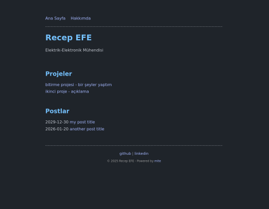
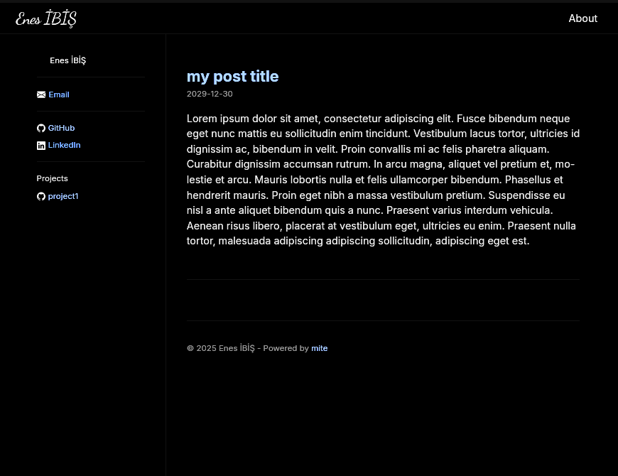

</div>

# Source Code
Source is available on GitHub: [https://github.com/hanion/mite](https://github.com/hanion/mite)


