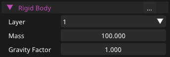
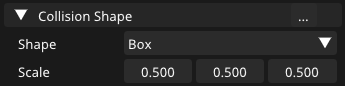

---
page->layout = "post";
page->title  = "My experience with Jolt Physics";
page->date   = "2025-02-03";
page->tags   = "game engine physics";
//image: "cover.png"
---

<figure>

<figcaption>Jolt Physics working in enik-engine</figcaption>
</figure>

I’ve been using my own custom physics engine for a while now, and it’s been a great learning experience.  
I built it from scratch, and it served me well. I even made **two games**<a href="#two-games-ref">[1]</a> with it!  

But as my projects grew, I started feeling the need for more advanced features. Plus, I’m planning to move into **3D** eventually, and I didn’t want to spend more time expanding my physics engine.  

So, I decided to upgrade to **Jolt Physics**.

---

## Why Jolt?  

Jolt is a **modern, fast, and open-source** physics engine that seemed like a great fit for my needs.
I wanted something that was **well-designed, performant, and extensible**, and Jolt checked all those boxes.  
It supports proper angular velocity and 3D physics, which are things my custom physics engine lacked.
Since I eventually plan to move into 3D, I didn’t want to spend more time expanding my own physics system when Jolt already provided a solid, ready-to-use solution.
Switching to Jolt felt like the right move to future-proof my engine while also giving me access to more advanced physics capabilities.

---

## Getting Started with Jolt  

The first thing I did was **clone the Jolt repository** separately and build it to make sure everything worked. No surprises here, it built without any issues.  

Once I confirmed that, I added Jolt as a **submodule** to my engine and integrated it into the build system. Again, no problems.  

Next, I started implementing Jolt into my engine. I began by reading the **HelloWorld.cpp** file that comes with Jolt.  

> Honestly, this file is a goldmine. It’s a great starting point, and the comments are super helpful.  

I copied some of the setup code, even though I didn’t fully understand everything at first. I figured I’d get to that later. For now, I just wanted to **get something working**.

---

## Re-architecting My Components  

My custom physics engine was simple but effective.
It had a **Collider** and **RigidBody** component and used **Euler integration** to handle forces, acceleration, velocity, and position.

It worked well for 2D, but it was limited in several ways.
There was no support for angular velocity, and it couldn’t handle a third dimension.  
Jolt, on the other hand, is a full-featured physics engine, so I had to rethink my architecture to take advantage of its capabilities.  
My first attempt at restructuring didn’t work out, but after some trial and error, I settled on a model that felt clean and intuitive.

---

## The Architecture  

When I started integrating Jolt into my engine, I knew I needed to rethink my component structure to align with Jolt’s approach to physics bodies.  
Jolt defines three primary types of bodies:  

- **Static Bodies** – These bodies don’t move or simulate in the physics world. They are used for immovable objects like walls or floors that can still collide with other bodies but don’t respond to forces.  
- **Dynamic Bodies** – These bodies are moved by forces, such as gravity or collisions, and are fully simulated in the physics world.  
- **Kinematic Bodies** – These bodies are moved manually by directly setting their velocities, without using forces. They can still interact with other bodies, making them ideal for things like moving platforms or doors.  

For more on these concepts, check out the [Jolt Physics documentation](https://jrouwe.github.io/JoltPhysics/index.html).

Along with these body types, Jolt provides a sensor flag, which is a simple checkbox to indicate whether a body should act as a sensor (detecting other objects but not interacting physically).
In my engine, however, I chose to handle sensors as a flag applied specifically to `CollisionBody` components.  

### PhysicsBodyBase: The Foundation  

At the core of my physics system is the `PhysicsBodyBase` struct, which serves as the foundation for all physics bodies in my engine.
This struct holds a pointer to a Jolt body and includes some basic properties, such as:

- **Motion Type** – This determines how the body behaves in the physics simulation. It can be static, dynamic, kinematic.  
- **Layer** – Used for collision filtering. I haven’t fully implemented this yet, but it’s planned for future use.  

The `PhysicsBodyBase` struct also provides functionality for getting and setting the body’s position, velocity, friction, and restitution.
It's designed to be extended by more specific components like `RigidBody` and `CollisionBody`.  

### RigidBody: Dynamic Physics Objects  

<figure>

<figcaption>RigidBody component in inspector</figcaption>
</figure>

The `RigidBody` component inherits from `PhysicsBodyBase` and is specifically designed for **dynamic bodies**, objects that are fully simulated and moved by forces.

It supports applying forces and impulses, which makes it great for things like jumping, explosions, or any kind of physics-based movement.
Torque can be applied to rotate the body, and both mass and gravity can be adjusted to control how it reacts to the environment.  

In short, `RigidBody` component is for anything that needs to interact dynamically with the physics world.

### CollisionBody: Simplified Physics Interaction  

<figure>

<figcaption>CollisionBody component in inspector</figcaption>
</figure>

The `CollisionBody` component also inherits from `PhysicsBodyBase`, but it’s used for bodies that either **don’t move** or are **moved manually**.  

In my engine, the **sensor** flag is applied specifically to `CollisionBody` components.
A **sensor** is a body that doesn’t physically collide with other bodies but instead detects when something enters or exits its area.
This is useful for things like trigger zones or proximity detection.

One important distinction in my engine is that **only** `CollisionBody` **components can be sensors**, which means a sensor cannot be a `RigidBody`.
I decided this because I didn’t foresee a need for dynamic bodies that only detect interactions without reacting physically.
Therefore, a sensor flag can only be applied to static or kinematic `CollisionBody` components.

For example, a sensor could be used to detect when an object enters a certain area, like an enemy's detection radius or a trigger for a door to open.
This keeps the system simple and ensures that only non-dynamic bodies can act as sensors.

### CollisionShape: Defining the Shape of Bodies  

<figure>

<figcaption>CollisionShape component in inspector</figcaption>
</figure>

Every physics body needs a shape, and that’s where the `CollisionShape` struct comes in.
Currently, it supports two basic 2D shapes: Box and Circle.

In the future, I plan to add more primitive shapes.
Right now, there are no 3D primitives in the engine, but once I introduce them, I’ll be able to handle 3D physics shapes.

The most important future feature for collision shapes is **composite shapes**.
Composite shapes allow me to combine multiple primitives into a single body.
For example, I could combine several boxes and spheres to create a more complex shape, like a car.
Jolt’s documentation shows this is possible, and it’s something I’ll implement in the future.
Once composite shapes are in place, each body will look at its child collision shapes, combine them into a single unified shape, and use that for the physics calculations.
This will make it easier to create more complex objects.

For now, each body only has one shape, but this approach will evolve to accommodate more complexity as the engine grows.

---

## Initial Results  

After setting everything up, I was pleasantly surprised by how well everything worked.
Jolt's collision detection is reliable, and integration was smoother than expected.
Overall, I'm satisfied with the results so far and how the architecture is shaping up.

---

## What’s Next?  

For now, my focus is on perfecting the basics. But there’s plenty more to explore:  
- Composite shapes  
- 3D primitives and 3D physics  
- 3D rendering  
- Later on, soft bodies, joints, and vehicle physics  

---

If you're considering integrating **Jolt** into your own engine, I highly recommend it.
It offers **great documentation**, and it’s a reliable and future-proof choice.
Whether you're just getting started or looking to expand your engine, Jolt provides the solid foundation you need to grow.

> Go for it.

You can check out the following links for more information:  
- **Jolt Physics**: [https://github.com/jrouwe/JoltPhysics](https://github.com/jrouwe/JoltPhysics)  
- **My Game Engine**: [https://github.com/hanion/enik-engine](https://github.com/hanion/enik-engine)  

<iframe frameborder="0" src="https://itch.io/embed/3202738?linkback=true&amp;border_width=0&amp;bg_color=1a1a1a&amp;fg_color=ffffff&amp;link_color=00d929&amp;border_color=1a1a1a" width="100%" height="165"><a href="https://hanion.itch.io/enik-engine">enik-engine by hanion</a></iframe>

---

<small id="two-games-ref"><a href="#two-games">[1]</a> These two games were made during game jams and are available on itch.io: [reborn](https://hanion.itch.io/reborn) and [gear gambit](https://hanion.itch.io/gear-gambit).
</small>

